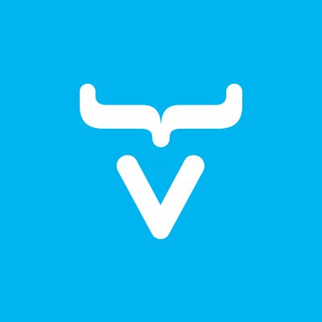

# Hi there, I'm Najlae 👋 

## I'm currently a Software Development Student 💻 and I'm soon to become an Indie Game Developer 🎮

- 🎲 I’m currently learning 3d modeling in blender
- 👯 I’m looking to connect with more artists and game developers
- 🥅 2023 Goals: Learn more about Game Development 🎮

### Connect with me:

&nbsp;&nbsp;

### Languages and Tools:

 
 

### GitHub Stats:

  
 

