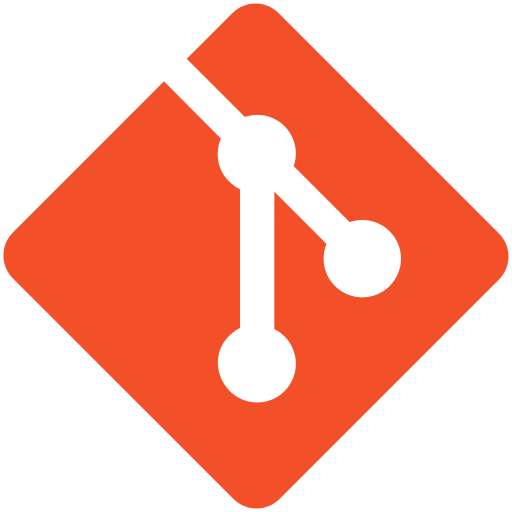

# Hi there, I'm Najlae 👋 

- 🎲 I’m currently working on various projects
- 👯 I’m looking to connect with more artists and game developers
- 🥅 2024 Goal: Make more Tech Art Projects🎮

### Find me on:

&nbsp;&nbsp;

  

### My Languages and Tools:

  

  
 

&nbsp;&nbsp;

### My Programming Stats
|  |  |
| ------------- | ------------- |

|  | 
| ------------- | 
