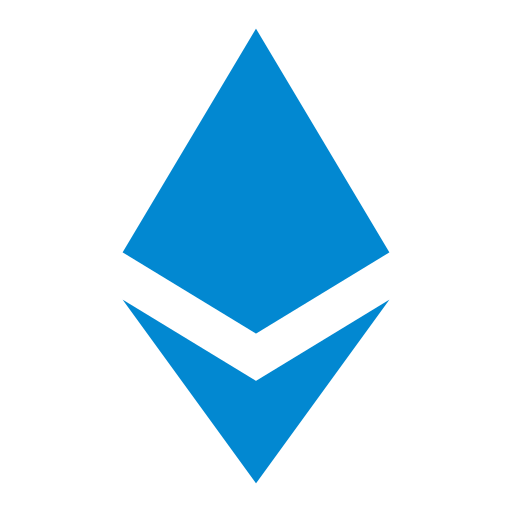

# Hi there, I'm Najlae 👋 

- 🎲 I’m currently working on various projects

### Find me on:

   

### Languages:

  

### Databases:

  

### Frameworks & Libraries:

  

### Artificial Intelligence:

  

### Tools & Technologies:

  

### Other:

    

### My Programming Stats

|  |  |
| ------------- | ------------- |

|  | 
| ------------- | 

### Tags

- **college-project Tag**: Projects related to my academic studies.
- **hobby-project Tag**: Personal projects I work on in my free time for fun and/or learning purposes.
- **cs50 Tag**: Projects related to the CS50 course.
